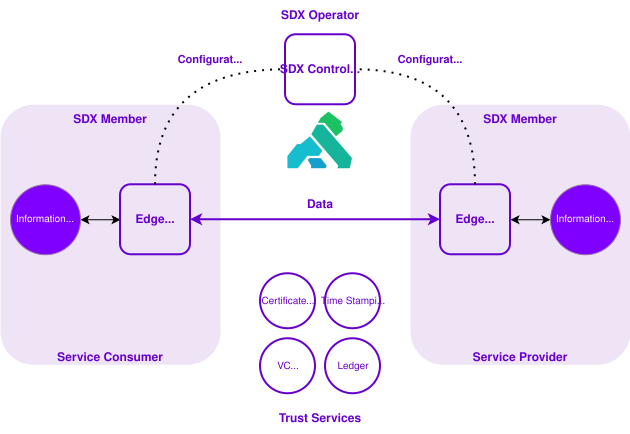

# Secure Data Exchange (SDX)

## What is SDX?

Secure Data Exchange (SDX) enables organizations to share information when additional security, governance, and privacy controls are required. When one organization needs to send information to another, like a government ministry sharing data with a delivery partner, SDX handles the security in the background. It makes sure the connection is protected, checks that only approved organizations are involved, and protects the information the whole way from sender to receiver. Every organization that uses SDX, whether they're providing data, using it, or both, gets the same consistent protection and rules built in.

SDX is built around two foundational capabilities: security controls and governance and compliance.

### Security Controls

When your organization sends or receives information through SDX, several protections work automatically to keep that information safe along the way.

SDX automatically:

- Protects the data while it's moving, so it can't be read if someone intercepts it (*encryption in transit*)
- Checks that only approved, verified systems are sending or receiving the data (*authentication*)
- Confirms the data arrives exactly as it was sent, with nothing changed along the way (*data integrity verification*)
- Keeps the connection between organizations protected for the entire exchange (*secure communications*)

**Example:** A ministry program needs to send a citizen's income information to a partner organization. Before the data leaves, SDX encrypts it so it can't be read if intercepted. SDX also confirms the receiving system is an approved participant, and checks that what arrives matches exactly what was sent, no tampering, no changes.

### Governance and Compliance

When information is exchanged through SDX, governance controls automatically create a trusted record of what happened. These records help organizations show that information was shared the right way, and support security, privacy, and compliance requirements. These controls:

- Keep a record of who exchanged information, when it happened, and what actions were taken
- Only allow access that's been specifically approved ahead of time, based on what each system is permitted to do
- Create proof of who sent and received each exchange, so no one can later deny it happened
- Record the exact date and time of every exchange

**Example:** A ministry shares information with another organization to verify a citizen's eligibility for a program. SDX records who started the exchange, confirms they had permission to do it, captures exactly when it happened, and keeps a record that can be checked later. Together, this shows the information was shared securely and by the rules.

These controls help organizations meet B.C.'s security, privacy, and regulatory requirements for sharing information safely.

### Why it matters

More government programs need to share sensitive information to deliver services that work well together. Without a shared, secure way to do this, every organization would have to build and maintain its own security systems and trust relationships, for every single partner. SDX solves this by giving every organization the same secure foundation to work from. This lets organizations:

- Share sensitive information safely with other organizations
- Protect citizen information the whole time it's being exchanged
- Meet the same security and compliance rules every time, instead of figuring it out separately for each exchange
- Set up trusted connections with partner organizations more easily
- Keep a record of who did what during every exchange, so it can be checked later (auditability and accountability)

### How SDX supports Connected Services

#### SDX Architecture

At a high level, SDX provides a secure connection between organizations that share or consume services. Each organization uses an SDX Edge Runtime Group to connect its systems to the SDX platform and to the other organization involved in an exchange. SDX also uses shared trust services to support secure, traceable exchanges.

*Figure 1. High-level view of SDX*

The diagram is intended as a high-level view. The technical details of how these components are configured are covered in the [SDX technical documentation](https://developer.gov.bc.ca/docs/default/component/aps-infra-platform-docs/concepts/secure-data-exchange/).

Connected Services is about letting different organizations work together while keeping information secure and properly governed. SDX is the part that makes this possible. It does this by:

- Setting up trusted, verified connections between organizations
- Applying the same security protections to every exchange
- Deciding who's allowed to access what, based on rules set ahead of time (policy-based access)
- Keeping a record of every exchange for auditing and accountability
- Letting organizations securely exchange data anywhere across Connected Services

Because SDX handles these shared protections, teams building services on Connected Services can focus on the actual work they're trying to do, instead of building their own security systems from scratch for every new connection.

## Related services

- [API Services Portal](https://api.gov.bc.ca/)
